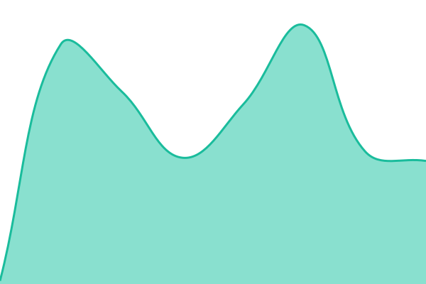

# [📈 Estado en vivo](https://radar.takkini.eu.org): <!--live status--> **🟧 Interrupción parcial**

Bienvenidos al monitor de actividad y la página de estado de [TeroRERO](http://www.devinconde.com), Basado en [Upptime](https://github.com/upptime/upptime).

With [Upptime](https://upptime.js.org), you can get your own unlimited and free uptime monitor and status page, powered entirely by a GitHub repository. We use [Issues](https://github.com/terorero/monitor/issues) as incident reports, [Actions](https://github.com/terorero/monitor/actions) as uptime monitors, and [Pages](https://radar.takkini.eu.org) for the status page.

<!--start: status pages-->
<!-- This summary is generated by Upptime (https://github.com/upptime/upptime) -->
<!-- Do not edit this manually, your changes will be overwritten -->
<!-- prettier-ignore -->
| URL | Status | History | Response Time | Uptime |
| --- | ------ | ------- | ------------- | ------ |
|  [iPHOTO LR](https://iphoto.la-razon.com) | 🟥 Down | [i-photo-lr.yml](https://github.com/terorero/monitor/commits/HEAD/history/i-photo-lr.yml) | 

 3606ms
     
 | 

<a href="https://radar.takkini.eu.org/history/i-photo-lr">0.00%</a>
    

|  [Remoto LR](https://remoto-ti.la-razon.com) | 🟥 Down | [remoto-lr.yml](https://github.com/terorero/monitor/commits/HEAD/history/remoto-lr.yml) | 

 56ms
     
 | 

<a href="https://radar.takkini.eu.org/history/remoto-lr">0.00%</a>
    

|  [Remoto VIP LR](https://remoto.la-razon.com) | 🟩 Up | [remoto-vip-lr.yml](https://github.com/terorero/monitor/commits/HEAD/history/remoto-vip-lr.yml) | 

 635ms
     
 | 

<a href="https://radar.takkini.eu.org/history/remoto-vip-lr">100.00%</a>
    

|  [Container 1](https://docker1.la-razon.com) | 🟩 Up | [container-1.yml](https://github.com/terorero/monitor/commits/HEAD/history/container-1.yml) | 

 575ms
     
 | 

<a href="https://radar.takkini.eu.org/history/container-1">99.41%</a>
    

|  [Container 2](https://docker2.la-razon.com) | 🟥 Down | [container-2.yml](https://github.com/terorero/monitor/commits/HEAD/history/container-2.yml) | 

 42ms
     
 | 

<a href="https://radar.takkini.eu.org/history/container-2">0.00%</a>
    

|  [Container 3](https://docker3.la-razon.com) | 🟥 Down | [container-3.yml](https://github.com/terorero/monitor/commits/HEAD/history/container-3.yml) | 

 43ms
     
 | 

<a href="https://radar.takkini.eu.org/history/container-3">0.00%</a>
    

|  [Paper Flip LR](https://paper.la-razon.com) | 🟥 Down | [paper-flip-lr.yml](https://github.com/terorero/monitor/commits/HEAD/history/paper-flip-lr.yml) | 

 19490ms
     
 | 

<a href="https://radar.takkini.eu.org/history/paper-flip-lr">100.00%</a>
    

|  [Drive24](https://drive.root24.eu.org) | 🟩 Up | [drive24.yml](https://github.com/terorero/monitor/commits/HEAD/history/drive24.yml) | 

 1653ms
     
 | 

<a href="https://radar.takkini.eu.org/history/drive24">100.00%</a>
    

<!--end: status pages-->

[**Visite nuestro monitor web →**](https://radar.takkini.eu.org)

## 📄 License

- Powered by: [Upptime](https://github.com/upptime/upptime)
- Code: [MIT](./LICENSE) © [TeroRERO](http://www.devinconde.com)
- Data in the `./history` directory: [Open Database License](https://opendatacommons.org/licenses/odbl/1-0/)
