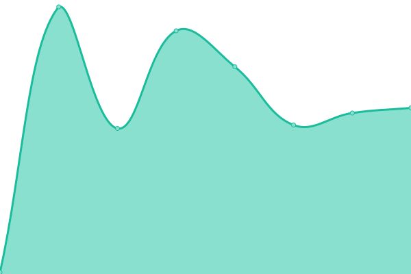

# [📈 Estado en vivo](https://radar.takkini.eu.org): <!--live status--> **🟧 Interrupción parcial**

Bienvenidos al monitor de actividad y la página de estado de [TeroRERO](http://www.devinconde.com), Basado en [Upptime](https://github.com/upptime/upptime).

With [Upptime](https://upptime.js.org), you can get your own unlimited and free uptime monitor and status page, powered entirely by a GitHub repository. We use [Issues](https://github.com/terorero/monitor/issues) as incident reports, [Actions](https://github.com/terorero/monitor/actions) as uptime monitors, and [Pages](https://radar.takkini.eu.org) for the status page.

<!--start: status pages-->
<!-- This summary is generated by Upptime (https://github.com/upptime/upptime) -->
<!-- Do not edit this manually, your changes will be overwritten -->
<!-- prettier-ignore -->
| URL | Status | History | Response Time | Uptime |
| --- | ------ | ------- | ------------- | ------ |
|  [CSBP portal](https://portal.csbp.com.bo) | 🟥 Down | [csbp-portal.yml](https://github.com/terorero/monitor/commits/HEAD/history/csbp-portal.yml) | 

 5686ms
     
 | 

<a href="https://radar.takkini.eu.org/history/csbp-portal">88.37%</a>
    

|  [CSBP Home](https://www.csbp.com.bo) | 🟥 Down | [csbp-home.yml](https://github.com/terorero/monitor/commits/HEAD/history/csbp-home.yml) | 

 3476ms
     
 | 

<a href="https://radar.takkini.eu.org/history/csbp-home">90.26%</a>
    

|  [CSBP Asegurados](https://asegurados.csbp.com.bo) | 🟩 Up | [csbp-asegurados.yml](https://github.com/terorero/monitor/commits/HEAD/history/csbp-asegurados.yml) | 

 1822ms
     
 | 

<a href="https://radar.takkini.eu.org/history/csbp-asegurados">91.30%</a>
    

|  [CSBP Citas web](https://citas.csbp.com.bo) | 🟥 Down | [csbp-citas-web.yml](https://github.com/terorero/monitor/commits/HEAD/history/csbp-citas-web.yml) | 

 1785ms
     
 | 

<a href="https://radar.takkini.eu.org/history/csbp-citas-web">90.12%</a>
    

|  [LR-Sisetic](https://larazon.sisetic.com) | 🟥 Down | [lr-sisetic.yml](https://github.com/terorero/monitor/commits/HEAD/history/lr-sisetic.yml) | 

 0ms
     
 | 

<a href="https://radar.takkini.eu.org/history/lr-sisetic">0.00%</a>
    

|  [TransTurin Website](https://www.transturin.com) | 🟩 Up | [trans-turin-website.yml](https://github.com/terorero/monitor/commits/HEAD/history/trans-turin-website.yml) | 

 2317ms
     
 | 

<a href="https://radar.takkini.eu.org/history/trans-turin-website">100.00%</a>
    

|  [Paper Flip LR](https://paper.la-razon.com) | 🟥 Down | [paper-flip-lr.yml](https://github.com/terorero/monitor/commits/HEAD/history/paper-flip-lr.yml) | 

 110ms
     
 | 

<a href="https://radar.takkini.eu.org/history/paper-flip-lr">100.00%</a>
    

|  [Ventas Inmediatas](https://ventasinmediatas.transturin.com) | 🟥 Down | [ventas-inmediatas.yml](https://github.com/terorero/monitor/commits/HEAD/history/ventas-inmediatas.yml) | 

 0ms
     
 | 

<a href="https://radar.takkini.eu.org/history/ventas-inmediatas">0.00%</a>
    

<!--end: status pages-->

[**Visite nuestro monitor web →**](https://radar.takkini.eu.org)

## 📄 License

- Powered by: [Upptime](https://github.com/upptime/upptime)
- Code: [MIT](./LICENSE) © [TeroRERO](http://www.devinconde.com)
- Data in the `./history` directory: [Open Database License](https://opendatacommons.org/licenses/odbl/1-0/)
